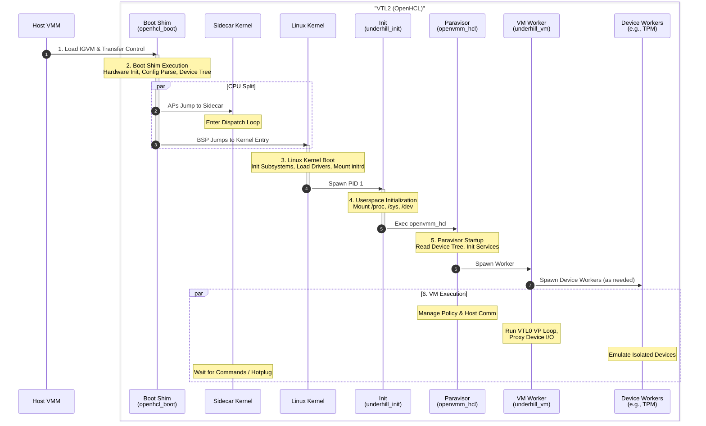

# OpenHCL Boot Flow

This document describes the sequence of events that occur when OpenHCL boots, from the initial loading of the IGVM image to the fully running paravisor environment.

## 1. IGVM Loading

The boot process begins when the host VMM loads the OpenHCL IGVM image into VTL2 memory.
The IGVM image contains the initial code and data required to start the paravisor, including the boot shim, kernel, and initial ramdisk.
The host places sections of the IGVM image at headers described by the IGVM format, which includes runtime dynamic data such as the device tree and other configuration values.

## 2. Boot Shim Execution (`openhcl_boot`)

The host transfers control to the entry point of the **Boot Shim**.

1. **Hardware Init:** The shim initializes the CPU state and memory management unit (MMU).
2. **Config Parsing:** It parses configuration from multiple sources:
    * **Contents of the IGVM image**, including:
      * **Measured parameters** Fixed parameters encoded into the measured section of the IGVM image, loaded by the host.
    * **Command Line:** It parses the kernel command line, which can be supplied via IGVM or the host device tree.
    * **Host Device Tree:** A device tree provided by the host containing topology and resource information.
3. **New Device Tree:** It constructs a Device Tree that describes the hardware topology (CPUs, memory) to the Linux kernel.
4. **Sidecar Setup (x86_64):** The shim determines which CPUs will run Linux (typically just the Bootstrap Processor (BSP)) and which will run the Sidecar (APs). It sets up control structures and directs Sidecar CPUs to the Sidecar entry point.
    * **Sidecar Entry:** "Sidecar CPUs" jump directly to the Sidecar kernel entry point instead of the Linux kernel.
    * **Dispatch Loop:** These CPUs enter a lightweight dispatch loop, waiting for commands.
5. **Kernel Handoff:** Finally, the BSP (and any Linux APs) jumps to the Linux kernel entry point, passing the Device Tree and command line arguments.

## 3. Linux Kernel Boot

The **Linux Kernel** takes over on the BSP and initializes the operating system environment. Sidecar CPUs remain in their dispatch loop until needed (e.g., hot-plugged for Linux tasks).

1. **Kernel Init:** The kernel initializes its subsystems (memory, scheduler, etc.).
2. **Driver Init:** It loads drivers for the paravisor hardware and standard devices.
3. **Root FS:** It mounts the initial ramdisk (initrd) as the root filesystem.
4. **User Space:** It spawns the first userspace process, `underhill_init` (PID 1).

## 4. Userspace Initialization (`underhill_init`)

`underhill_init` prepares the userspace environment.

1. **Filesystems:** It mounts essential pseudo-filesystems like `/proc`, `/sys`, and `/dev`.
2. **Environment:** It sets up environment variables and system limits.
3. **Exec:** It replaces itself with the main paravisor process, `/bin/openvmm_hcl`.

## 5. Paravisor Startup (`openvmm_hcl`)

The **Paravisor** process (`openvmm_hcl`) starts and initializes the virtualization services.

1. **Config Discovery:** It reads the system topology and configuration from `/proc/device-tree` and other kernel interfaces.
2. **Service Init:** It initializes internal services, such as the VTL0 management logic and host communication channels.
3. **Worker Spawn:** It spawns the **VM Worker** process (`underhill_vm`) to handle the high-performance VM partition loop.

## 6. VM Execution

At this point, the OpenHCL environment is fully established.

The `underhill_vm` process runs the VTL0 guest, handling exits and coordinating device emulation. During VM initialization, security-sensitive devices requiring isolation (such as the virtual TPM) are spawned as dedicated **device worker processes** that run the emulation logic in separate, sandboxed processes. The VM worker proxies I/O operations and guest memory accesses between the guest and these isolated device emulators.

Meanwhile, `openvmm_hcl` manages the overall policy and communicates with the host.

## Comparing Servicing and Kexec Blackout

Build both the outgoing and incoming OpenHCL images with the timing
instrumentation. After resume, `underhill_core` emits one
`servicing blackout phases` event with `method="host"` or `method="kexec"`,
the servicing correlation ID, `total`, and a list of named durations in
`phases`. No per-checkpoint events are emitted. Outgoing checkpoints are
carried in an optional saved-state field, so they survive the log flush
and restart. An older outgoing image without that field produces no phase
summary.

All checkpoints use hypervisor reference time in 100ns units, including
the existing bootloader timestamps. The adjacent intervals below partition
the existing `blackout_time`; their sum equals `total` without adding the
separately logged state-unit durations. Summary formatting and output happen
after the blackout endpoint has been captured.

| Phase | Interval |
|---|---|
| `stop` | Blackout start through completion of VM stop, including its logging. |
| `save` | Full save, including emulation platform, state units, drivers, VMBus client, and compatibility fixups. |
| `shutdown` | Persist boot information and finish concurrent PCI, MANA, and NVMe shutdown. |
| `flush` | Log-flush request and completion, including surrounding orchestration. |
| `handoff` (host only) | Flush completion through the next bootloader's start checkpoint. |
| `bootloader` (host only) | Bootloader start through its saved end checkpoint; includes sidecar setup. |
| `kernel_init` (host only) | Bootloader tail, kernel boot, init process, VMM and transport startup, through VM worker initialization entry. |
| `handoff_kernel_init` (kexec only) | Flush completion through VM worker initialization entry, without a bootloader run. |
| `settings` | Read device platform settings and construct the thread pool. |
| `state_read` | Retrieve and decode saved state from the host or persisted memory. |
| `state_fixup` | Restore compatibility fixups, clear persisted kexec state, and prepare the timing ledger. |
| `vm_build` | Reconstruct the VM, mappings, device managers, and channels. |
| `restore` | Restore state units, including surrounding dispatch work. |
| `restore_notify` | Report the restore result to the host; no host notification on kexec. |
| `resume_wait` | Remaining worker setup and scheduling until VM start begins. |
| `start` | Start state units through the existing blackout endpoint. |

Kexec loads the extracted kernel and initrd directly and bypasses
`openhcl_boot`. Any retained bootloader timestamps describe an earlier boot
and must not be used for this transition. Compare its `handoff_kernel_init`
with the sum of host servicing's `handoff`, `bootloader`, and `kernel_init`.
The kexec interval includes serialization, local state persistence, sidecar
preparation, kernel handoff, and startup of the new kernel and userspace.

For host servicing, `handoff` includes serialization and host state
transfer/restart. Separating host processing from transfer and restart
requires host-side timestamps. Image staging before VM stop is outside
blackout. Kernel and early userspace are deliberately grouped to avoid
additional instrumentation in the kernel or init process.

If a required timestamp is unavailable or moves backward, `phases=None`
reports that the breakdown is unavailable instead of inventing durations.
The original blackout measurement is unchanged. The early timing reader
opens one hypercall handle per worker initialization; the kernel may log
its allow-map setup. There are no serial writes for individual checkpoints.

Keep device configuration, CPU count, keepalive settings, and logging levels
the same when comparing runs. Kexec uses the existing NVMe keepalive
configuration and servicing save/restore path, including pending-command
handling. It still disables MANA keepalive, while host servicing may enable
it. A difference in `save` or `shutdown` may therefore reflect keepalive
policy rather than the restart mechanism.

Do not mix `KERNEL_BOOT_TIME` (`CLOCK_BOOTTIME`) or bracketed kernel log
timestamps with these checkpoints. They use different clock origins, and
early boot timekeeping can differ from the log clock. Existing logging
overhead remains included in the interval where it occurs.

## NVMe Keepalive Across Kexec

Kexec honors `OPENHCL_NVME_KEEP_ALIVE` through the existing servicing path;
there is no separate kexec opt-in. The existing VFIO and persistent-pool
requirements still apply. NVMe driver state and DMA allocation metadata
use the same servicing payload, stored and read in preserved memory rather
than transferred through the host. Restore runs asynchronously as in host
servicing, using the existing pending-I/O restore and drain behavior.

No kexec-specific memory-map, reset-policy, or quiescent-I/O checks are added.
The kernel's VF, DMA memory, and interrupt preservation across kexec still
require validation on the target system.
